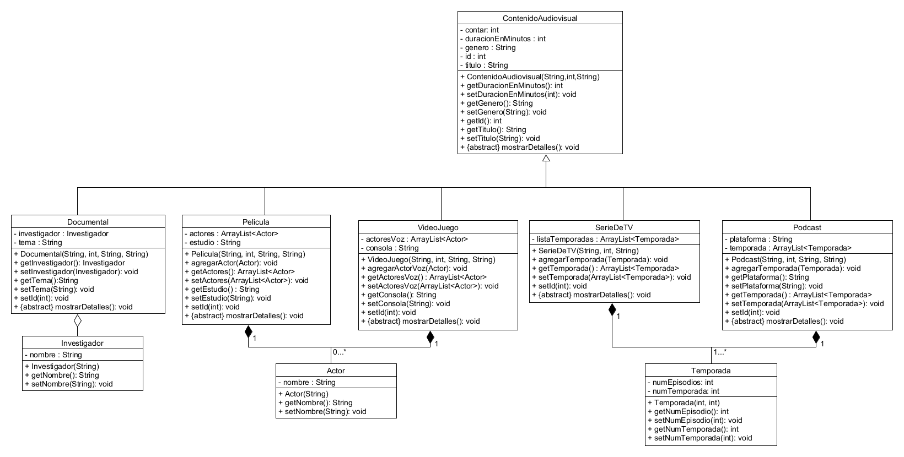

Sistema de Gestión Audiovisual (MVC):

Este proyecto es una aplicación de consola desarrollada en Java como parte de la materia de Programación Orientada a Objetos. El objetivo principal fue crear un sistema capaz de gestionar distintos tipos de contenidos multimedia, aplicando buenas prácticas de diseño y persistencia de datos.

Estructura del Código (Arquitectura MVC)

Para que el código sea ordenado y fácil de mantener, organizamos todo siguiendo el patrón MVC (Modelo-Vista-Controlador):

model: Aquí se encuentran nuestras clases principales (ContenidoAudiovisual como clase padre, y sus hijas como Pelicula, SerieDeTV, Documental, etc.). También incluimos las clases relacionadas por composición como Actor, Temporada e Investigador.

controller: Contiene la lógica del negocio. Aquí creamos ServicioArchivo, que se encarga exclusivamente de guardar y leer los datos en formato CSV, cumpliendo con el principio de Responsabilidad Única (SOLID).

view: Maneja la interacción con el usuario a través de la consola.

Cambios realizados
Refactorización a MVC: Separamos la lógica de los datos de la interfaz de usuario.

Persistencia CSV: Implementamos un servicio especializado para leer y escribir archivos, permitiendo que la información persista aunque el programa se cierre.

Encapsulamiento y Relaciones: Se aplicaron correctamente relaciones de herencia y composición (usando listas de objetos) en todas las clases.

Pruebas Unitarias: Creamos casos de prueba con JUnit 5 para asegurar que el guardado y la carga de datos (incluyendo objetos complejos como actores y temporadas) funcionen perfectamente.

Cómo usar el proyecto

Clonar el repositorio
Si quieres tenerlo en tu computadora, abre tu terminal y usa:
git clone <url-de-tu-repositorio>

Ejecutar el proyecto
Importa el proyecto en Eclipse como un proyecto Java existente.

Busca la clase principal (en el paquete view) y haz clic derecho -> Run As -> Java Application.

Ejecutar las pruebas unitarias
Para comprobar que todo está funcionando correctamente:

Ve a la carpeta src/test/java.

Haz clic derecho sobre ServicioArchivoTest.java.

Selecciona Run As -> JUnit Test. ¡Deberías ver una barra verde indicando que todo está OK!

Diagrama de Clases

Puedes consultar el diseño actualizado aquí:

